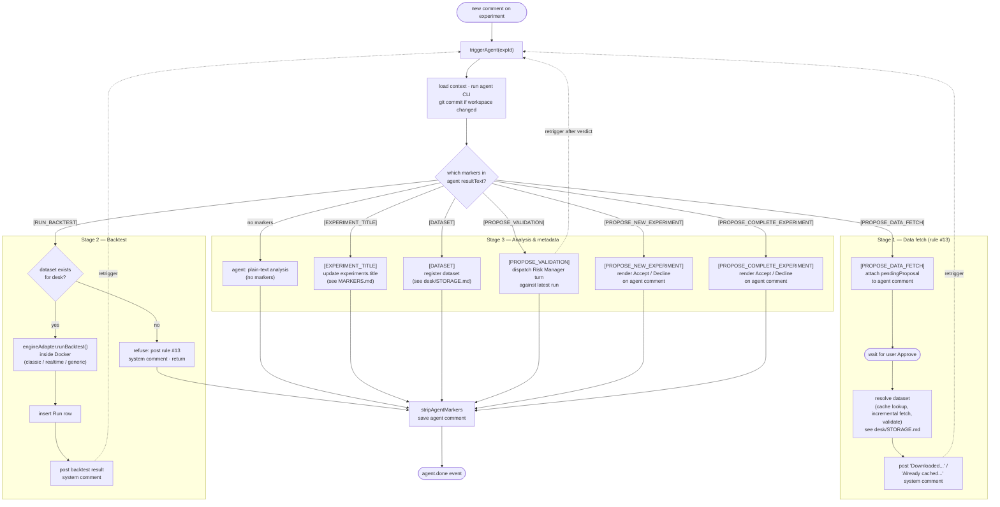
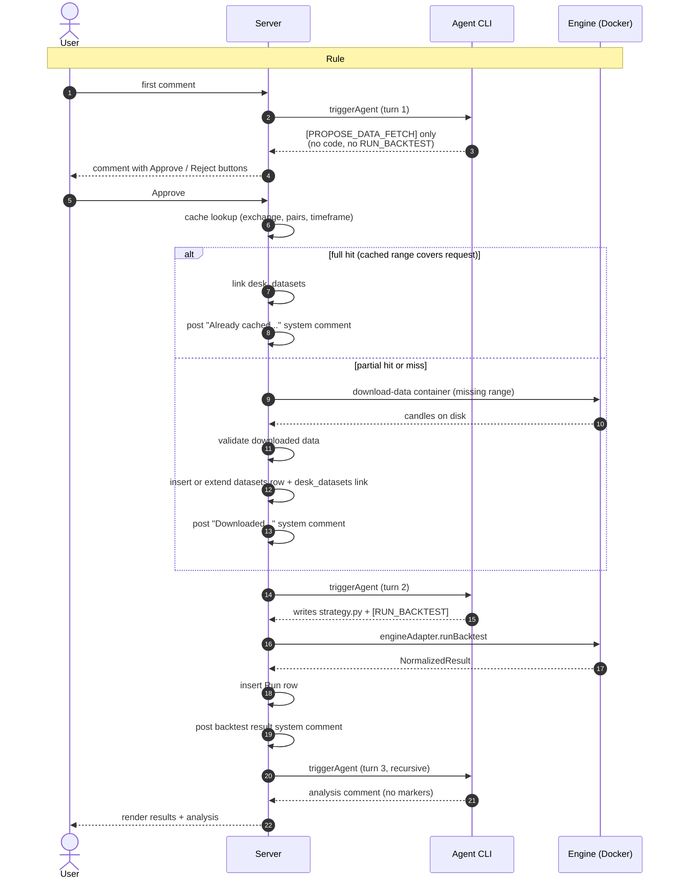

# Agent Turn Lifecycle

How a single agent turn is dispatched, what branches the server takes after parsing the agent's output, and how turns chain together across a desk's lifecycle. This document covers the **turn-based backtest cycle**; for long-running paper trading sessions (which have no turn end) see `./PAPER_LIFECYCLE.md`. For the underlying CLI execution mechanics see `./TURN.md`. For the marker glossary see `./MARKERS.md`.

`triggerAgent(experimentId)` in `server/src/services/agent-trigger.ts:168` is the single entry point for every agent turn. After the CLI subprocess returns, the server inspects `result.resultText` for marker blocks and dispatches the following branches. Branches are **not** mutually exclusive — they are checked in order within the same turn (the rule #13 refusal is the only early `return`).

The flow is best understood as a **lifecycle with three stages**, each driven by a separate `triggerAgent` turn. Within a single turn the server checks all marker branches, but across turns the desk progresses in this order: data fetch → strategy + backtest → analysis. The diagram below is organised by stage rather than by `if` statement.

**How to read this:**

- **Stage 1 (data fetch)** is the gate. A brand-new desk must traverse this before anything else — the agent proposes, the user approves, the server downloads, and only then does a `datasets` row exist.
- **Stage 2 (backtest)** can only succeed once Stage 1 has produced a dataset. The `dataset exists?` check at `B0` enforces this; without a dataset the server posts a refusal and returns, kicking the agent back to Stage 1.
- **Stage 3 (analysis)** is the terminal stage of any turn. After a backtest result comment is posted, the recursive `triggerAgent` lands here: the agent reads the result and replies with plain text. `[EXPERIMENT_TITLE]` and `[DATASET]` are side-channel metadata markers that can ride along on any turn. `[PROPOSE_VALIDATION]` dispatches a Risk Manager turn against the latest run and retriggers the Analyst with the verdict. `[PROPOSE_NEW_EXPERIMENT]` and `[PROPOSE_COMPLETE_EXPERIMENT]` attach Accept/Decline controls to the agent comment and wait for the user — they do not mutate state until the user acts.
- **Recursion** (`P4 → Trigger`, `B4 → Trigger`) is what stitches the stages together across turns. Each retrigger is a fresh `triggerAgent` invocation with the new system comment as input.
- **Stage 1 spans more than one HTTP request.** The agent turn that emits `[PROPOSE_DATA_FETCH]` ends as soon as the `pendingProposal` is saved on the comment; the server does not block on user approval. Approval (or rejection) arrives later as a separate user-initiated request, and that is what actually triggers the download → validate → datasets row → re-trigger chain. If the user closes the tab and never decides, the lifecycle simply pauses forever in `P2`.

## Intended first-desk happy path

For a brand-new desk with no strategy code and no registered dataset, rule #13 requires the agent to propose a data fetch first and wait for user approval before writing any code or running a backtest.

## Failure handling

There is **no automatic retry** anywhere in the lifecycle. If a stage fails, the run/turn is marked `failed` and the lifecycle stops — the server does not re-dispatch the same work on its own, and it does **not** advance to the next stage. A failure in Stage 1 means Stage 2 never runs; a failure in Stage 2 means Stage 3 never runs.

- **Stage 1 (data fetch)** — a download error posts a system comment describing the failure and retriggers the agent. The agent decides whether to propose a revised `[PROPOSE_DATA_FETCH]` (e.g. different pair naming, shorter window) or give up. The user can also simply comment again to nudge it.
- **Stage 2 (backtest)** — an engine/container error inserts the Run row with `status = failed` and posts the error as a system comment. No analysis turn is auto-dispatched. The next turn is a fresh `triggerAgent` triggered by the failure comment: the agent reads the failure, may edit `strategy.py`, and emits a **new** `[RUN_BACKTEST]` which becomes a new Run row. The failed run is preserved for history, never mutated in place.
- **Stage 3 (analysis)** — if the agent CLI itself crashes mid-turn, the turn ends with no comment saved. The user retriggers by commenting again.

Retry is therefore always **agent-driven and user-gated**, never a silent server loop. This keeps the audit trail (runs, comments, commits) linear and prevents runaway Docker spend on a broken strategy.
