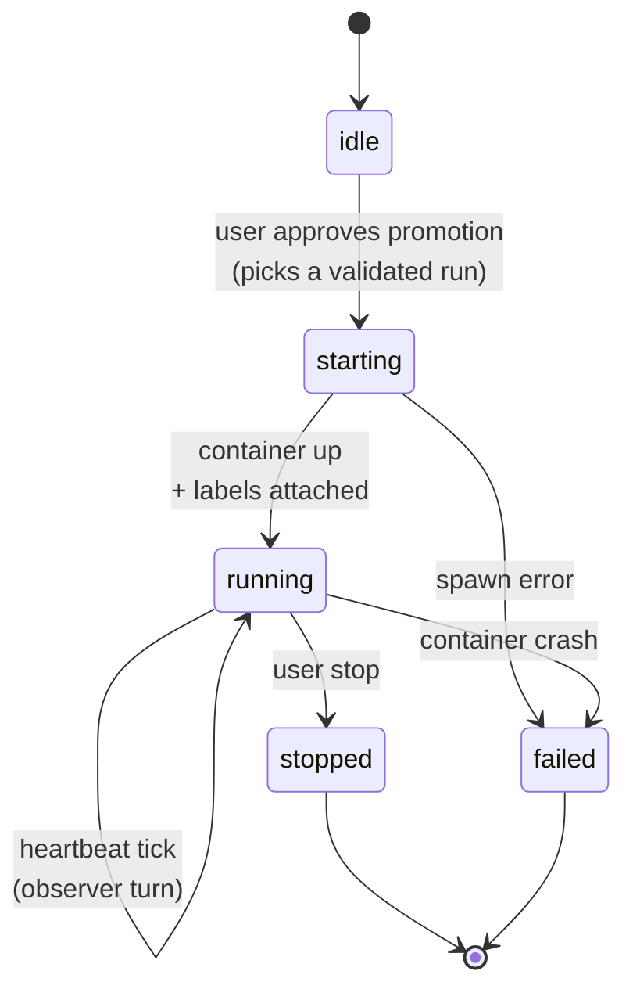
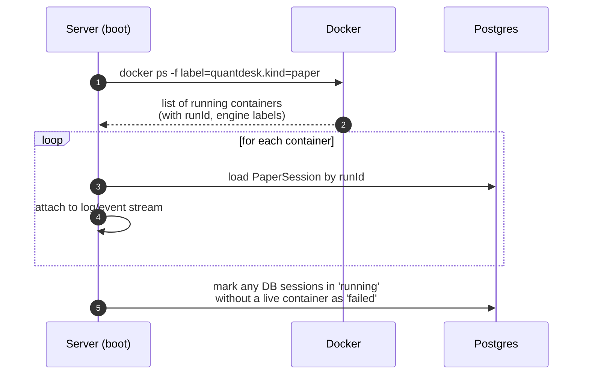

# Paper Trading Lifecycle

How a desk transitions from a validated backtest into a long-running paper trading session, how the agent participates while the session is alive, and how the server reconciles paper containers across restarts. For the turn-based backtest lifecycle see `./LIFECYCLE.md`.

## Why this is a separate model

Backtesting is a **request/response, turn-based** flow: `triggerAgent` runs the CLI once, parses markers, saves a comment, and the turn ends. Every turn has a clean start and end.

Paper trading has **no turn end.** Once the user promotes a validated strategy, an engine container starts and keeps running for days or weeks. There are exactly two terminal conditions:

1. The user explicitly stops it.
2. The container crashes (`failed`).

Everything in between is a **process/supervisor state machine**, not a turn cycle. The agent does not own paper trading — it sits on top as an **observer**, woken up only by scheduled heartbeats or notable events. Most of the time both the server and the agent are idle while the container streams fills and PnL into the database.

This is why paper trading needs its own lifecycle document: the diagrams, triggers, and failure semantics are fundamentally different from the backtest turn cycle.

## State machine

- **idle** — desk has runs but no active paper session.
- **starting** — server has accepted the promotion and is spawning the engine container. Short-lived; either advances to `running` or drops to `failed`.
- **running** — container is alive. The desk stays here for the bulk of its life. Self-loop on `running` represents observer turns triggered by heartbeats, not state changes.
- **stopped** — user-initiated terminal state. Container removed, desk returns to `idle`-eligible (user can promote a different run later).
- **failed** — crash or spawn error. **No automatic restart.** The desk waits for the user to investigate and either retry or pick a different run.

## Promotion gate

A desk can only enter `starting` when:

1. The desk's strategy mode maps to a paper-capable engine configuration (`classic` → Freqtrade `dry_run`, `realtime` → Nautilus `SandboxExecutionClient`, `generic` → agent-authored paper loop script inside the generic Ubuntu container).
2. The user explicitly approves a specific validated `runId` from the desk's history. There is no auto-promotion.
3. No other paper session is active for the desk (one paper session per desk at a time).

The promotion is recorded as a `PaperSession` row linked to the source `runId` and the desk's pinned engine.

## Container spawn

The server spawns the engine's paper mode inside Docker, using the same pinned image and `quantdesk.*` label set defined in `../engine/README.md` Docker Conventions — the `kind=paper` value is what distinguishes the container from backtest containers and what reconcile filters on.

Engine-specific paper config:

- **Freqtrade** — `dry_run: true` in the generated config. Same strategy code path as live, which gives the highest paper fidelity.
- **Nautilus** — `SandboxExecutionClient` wired into the trading node.
- **Generic** — the agent's paper loop script runs inside the generic Ubuntu+Python container; it IS the engine.

If spawn fails, the `PaperSession` row is marked `failed`, the error is posted as a system comment, and the agent is retriggered (entering the backtest-style failure flow so it can suggest a fix).

## Agent as observer

While the session is `running`, the agent is **not** in a turn loop. It is woken only by:

- **Scheduled heartbeats** — e.g. once per day, or on a desk-configured cadence. Each heartbeat is a single `triggerAgent` call where the agent reads recent fills, PnL, and open positions, then posts a short analysis comment. No code edits, no new runs, no marker side effects.
- **Notable events** — large drawdown crossing the desk's stop-loss, position open/close, or user comment on the experiment. These are explicit triggers, not polling.

Between triggers, the server only ingests container logs and order/PnL updates into the database. The agent CLI is not running.

## Reconcile on server restart

Paper sessions outlive the server process. On startup, the server rebuilds its in-memory paper registry from Docker rather than from the database:

Docker is the source of truth. A `PaperSession` row that claims `running` but has no matching container is reconciled to `failed` with a "container vanished during downtime" reason. This keeps the registry honest without losing sessions that survived the restart.

## Stop and failure

- **User stop** — server sends a graceful shutdown to the container, waits for it to flush, then `docker rm`. Session row → `stopped`. The agent is **not** retriggered; the user explicitly chose to end it.
- **Container crash** — detected via the log/event stream or the next reconcile pass. Session row → `failed`, error posted as a system comment, agent retriggered so it can analyze the crash and propose a fix (which would land as a normal backtest turn against an updated strategy).
- **No automatic restart, ever.** A crashed paper session stays `failed` until the user promotes a new run. This mirrors the backtest failure rule: retry is always agent-driven and user-gated, never a silent server loop.
