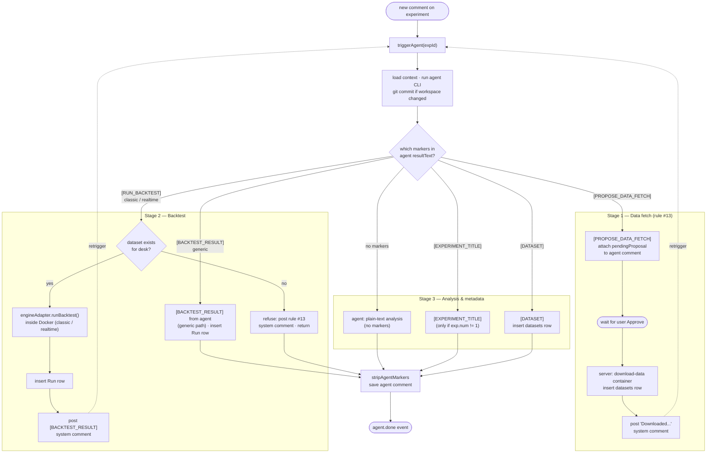
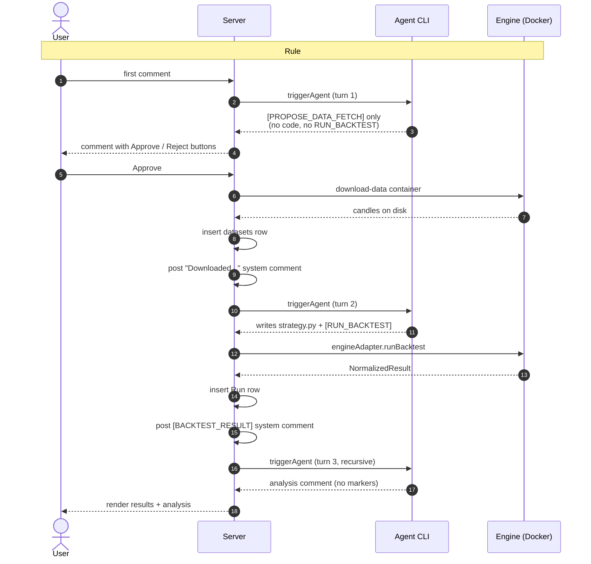

# Agent Execution

No heartbeat or scheduler. Simple request-response triggered by comments.

## Flow

1. Comment posted on experiment (user or system-generated on desk creation)
2. Server reads `adapter_type` + `adapter_config` from Agent Session
   ```bash
   # process + cli: claude
   claude --print - --output-format stream-json --verbose --resume {sessionId}
   # process + cli: codex
   codex exec --json resume {threadId} -
   # http → POST to adapter_config.url with API key
   ```
3. Prompt piped via stdin. The prompt context includes:
   - Desk config (budget, target_return, stop_loss, venues)
   - **`desk.strategy_mode`** (`classic` | `realtime`) and the resolved **`desk.engine`** (`freqtrade` | `nautilus` | `generic`), both immutable
   - Mode-specific instructions: which engine API the agent must use (Freqtrade `IStrategy` for classic, Nautilus `Strategy` event handlers for realtime, agent-authored script for generic)
   - **Paper trading is forbidden for generic desks** — the prompt instructs the agent to not propose `[PROPOSE_GO_PAPER]` in that case
   - Experiment context, run history, the triggering comment
4. Agent executes: writes code in workspace, runs engine backtest/paper (inside a Docker container), collects results
5. Output parsed from JSONL stream:
   - Claude: `system`, `assistant`, `result` events → session ID, usage, summary
   - Codex: `thread.started`, `item.completed`, `turn.completed` events → thread ID, usage, summary
6. Agent posts result as comment + creates Run record (backtest or paper)
7. Session ID persisted for resume on next comment

## Session Management

- Sessions are scoped to **desk** level (not experiment)
- Agent retains context across experiments within the same desk
- Prompt includes "currently working on Experiment #N" to focus the agent
- Unknown/expired session → automatic retry with fresh session

## Trigger Branching (single turn)

`triggerAgent(experimentId)` in `server/src/services/agent-trigger.ts:168` is the single entry point for every agent turn. After the CLI subprocess returns, the server inspects `result.resultText` for marker blocks and dispatches the following branches. Branches are **not** mutually exclusive — they are checked in order within the same turn (the rule #13 refusal is the only early `return`).

The flow is best understood as a **lifecycle with three stages**, each driven by a separate `triggerAgent` turn. Within a single turn the server checks all marker branches, but across turns the desk progresses in this order: data fetch → strategy + backtest → analysis. The diagram below is organised by stage rather than by `if` statement.



**How to read this:**

- **Stage 1 (data fetch)** is the gate. A brand-new desk must traverse this before anything else — the agent proposes, the user approves, the server downloads, and only then does a `datasets` row exist.
- **Stage 2 (backtest)** can only succeed once Stage 1 has produced a dataset. The `dataset exists?` check at `B0` enforces this; without a dataset the server posts a refusal and returns, kicking the agent back to Stage 1.
- **Stage 3 (analysis)** is the terminal stage of any turn. After a backtest result comment is posted, the recursive `triggerAgent` lands here: the agent reads the result and replies with plain text. `[EXPERIMENT_TITLE]` and `[DATASET]` are side-channel metadata markers that can ride along on any turn.
- **Recursion** (`P4 → Trigger`, `B4 → Trigger`) is what stitches the stages together across turns. Each retrigger is a fresh `triggerAgent` invocation with the new system comment as input.

### Intended first-desk happy path

For a brand-new desk with no strategy code and no registered dataset, rule #13 requires the agent to propose a data fetch first and wait for user approval before writing any code or running a backtest.



### Known fragile spots

- **Recursive re-trigger on both success and failure.** `[RUN_BACKTEST]` re-triggers the agent on success (`agent-trigger.ts:388`) and on failure (`agent-trigger.ts:400`). If the agent keeps emitting `[RUN_BACKTEST]` after a failure, the loop has no explicit budget — only the rule #13 refusal branch returns early.
- **Multiple markers in one reply.** A single agent response containing both `[PROPOSE_DATA_FETCH]` and `[RUN_BACKTEST]` will execute the backtest *and* attach the proposal to the comment, because branches are not mutually exclusive. This is currently prevented only by the prompt, not by a server-side guard.
- **Dataset existence is desk-scoped, not experiment-scoped.** The rule #13 gate (`agent-trigger.ts:312-315`) checks any dataset on the desk. A new experiment inside an existing desk will skip the propose/approve dance entirely if a sibling experiment already registered a dataset.
- **Experiment #1 title is pinned.** The `[EXPERIMENT_TITLE]` marker is ignored when `experiment.number === 1` (`agent-trigger.ts:529`), so the first experiment is permanently labelled `Baseline`.
